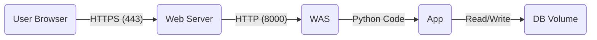

# [학습자료] 실무 배포 가이드: Docker와 Nginx

이 문서는 개발한 Flask 애플리케이션을 **실제 운영 환경**(Production)과 유사하게 배포하는 방법을 다룹니다. 단순히 `python app.py`로 실행하는 것과 무엇이 다른지, 왜 **Docker**와 **Nginx**를 사용하는지 학습해 봅시다.

## 1. 배포 아키텍처 이해하기

우리는 다음과 같은 3계층 구조로 서비스를 배포합니다.



1.  **Nginx (Web Server)**: 사용자의 요청을 가장 먼저 받습니다. HTTPS 암호화를 풀고, 정적 파일(이미지, CSS)을 처리하며, 동적 요청만 뒤쪽의 Gunicorn으로 넘깁니다. (리버스 프록시 역할)
2.  **Gunicorn (WAS)**: Python은 웹 서버 기능이 약하기 때문에, 전문적인 WSGI 서버인 Gunicorn이 Flask를 실행하고 관리합니다.
3.  **Docker Compose**: 이 모든 구성요소(Nginx, Gunicorn, DB Volume)를 하나의 세트처럼 관리해줍니다.

---

## 2. 배포 준비 (Configuration)

배포를 위해서는 보안 설정과 인증서 준비가 필요합니다.

### 2.1. 환경 변수 설정 (`.env`)
소스 코드에 비밀번호를 하드코딩하는 것은 보안상 매우 위험합니다. `.env` 파일을 만들어 관리합니다.

```bash
# 예시 파일 복사
cp .env.example .env
```

`.env` 파일을 열어 `FLASK_SECRET_KEY`와 `ADMIN_PASSWORD`를 자신만의 값으로 변경하세요.

### 2.2. SSL 인증서 생성 (HTTPS 필수)
우리는 세션 보안을 위해 HTTPS를 강제하고 있습니다. 로컬 환경이므로 **자가 서명 인증서**(Self-signed Certificate)를 직접 만들어 사용합니다.

```bash
# 인증서 저장 폴더 생성
mkdir -p nginx/ssl

# 인증서 생성 (유효기간 365일)
openssl req -x509 -nodes -days 365 -newkey rsa:2048 \
  -keyout nginx/ssl/server.key \
  -out nginx/ssl/server.crt \
  -subj "/CN=myserver.local" \
  -addext "subjectAltName=DNS:myserver.local,DNS:*.local,IP:127.0.0.1"
```
> **참고**: 실제 서비스에서는 'Let's Encrypt' 같은 공인 기관에서 인증서를 발급받아야 합니다.

---

## 3. 서비스 실행 (Docker Compose)

모든 준비가 끝났다면, Docker Compose를 이용해 서비스를 실행합니다.

### 3.1. 빌드 및 실행
```bash
# -d: 백그라운드 실행, --build: 이미지 새로 빌드
docker-compose up -d --build
```

이 명령어 하나로 다음 작업이 자동으로 수행됩니다.
1.  `Dockerfile`을 읽어 Flask 이미지를 빌드합니다.
2.  `nginx` 이미지를 다운로드합니다.
3.  네트워크를 생성하고 컨테이너들을 연결합니다.
4.  `sqlite_data` 볼륨을 마운트하여 DB 데이터를 보존합니다.

### 3.2. 상태 확인
```bash
docker-compose ps
```
모든 컨테이너(`flask_app`, `nginx_proxy`)의 상태가 `Up`이어야 합니다.

### 3.3. 로그 확인
문제가 발생했다면 로그를 확인하는 것이 가장 중요합니다.
```bash
docker-compose logs -f
```

---

## 4. 접속 및 테스트

브라우저를 열고 주소창에 입력해 봅시다.

*   **주소**: `https://myserver.local` (또는 `https://localhost`)
*   **주의**: 자가 서명 인증서를 사용했기 때문에 브라우저에서 "**연결이 비공개로 설정되어 있지 않습니다**"라는 경고가 뜹니다.
    *   Chrome: `고급` -> `...으로 이동(안전하지 않음)` 클릭
    *   이것은 인증서 발급 기관을 모른다는 뜻일 뿐, **통신 암호화는 정상적으로 작동**하고 있습니다.

---

## 5. 데이터 관리와 종료

### 5.1. 데이터 영속성 (Persistence)
Docker 컨테이너를 삭제했다가 다시 만들어도 게시글은 사라지지 않습니다.
*   **이유**: `docker-compose.yml`에 정의된 `volumes` 설정 덕분에, DB 파일(`schedule.db`)은 컨테이너 내부가 아닌 호스트의 Docker 볼륨 영역에 저장되기 때문입니다.

### 5.2. 서비스 종료
```bash
docker-compose down
```
서비스를 완전히 중지하고 네트워크를 정리합니다. (데이터는 유지됩니다)

---

## 6. 요약

| 단계 | 명령어/행동 | 핵심 내용 |
| :--- | :--- | :--- |
| **준비** | `openssl ...` | HTTPS 통신을 위한 인증서 생성 |
| **실행** | `docker-compose up -d` | 웹 서버와 WAS를 한 번에 실행 |
| **확인** | `docker-compose logs` | 실행 로그 모니터링 |
| **접속** | `https://...` | Nginx를 통한 보안 접속 확인 |

이 과정을 통해 여러분은 "**내 컴퓨터에서만 돌아가는 코드**"가 아니라, "**어디서든 배포 가능한 서비스**"를 만드는 방법을 익혔습니다.
