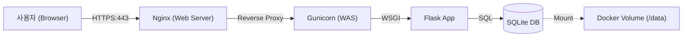

# 제품 요구사항 정의서 (PRD) - 프로젝트 일정 관리 보드

> **💡 교육용 가이드**
> 이 문서는 실제 현업에서 사용하는 **PRD(Product Requirements Document)** 형식을 따르고 있습니다.
> 단순한 코딩 연습을 넘어, "**어떤 문제를 해결하기 위해 어떤 기술적 결정이 내려졌는가**"를 이해하는 것이 이 프로젝트의 핵심 목표입니다.

## 1. 프로젝트 개요
*   **프로젝트명**: Lecture Notice Board (프로젝트 일정 관리 보드)
*   **목적**: 개발자 양성과정 학생들과 강사가 프로젝트 일정, 공지사항, 팀 구성을 효율적으로 공유하고 관리하기 위함.
*   **대상 사용자**:
    *   **학생 (User)**: 별도 로그인 없이 공지사항 및 일정 조회.
    *   **관리자 (Admin)**: 단일 비밀번호 인증을 통해 공지사항 등록, 수정, 삭제 (CRUD).

## 2. 시스템 아키텍처
본 프로젝트는 **실무 배포 환경**(Production)을 모사하기 위해 Docker 컨테이너 기반의 3-Tier 아키텍처를 채택합니다.

> **💡 아키텍처 선정 이유 (Educational Context)**
> *   **Nginx**: Flask 내장 서버는 보안과 성능이 약해 실무에서 쓰지 않습니다. HTTPS 처리와 정적 파일 서빙을 위해 Nginx를 앞단에 둡니다.
> *   **Gunicorn**: Python 코드를 안정적으로 실행하기 위한 WSGI 미들웨어입니다.
> *   **Docker Volume**: 컨테이너는 언제든 삭제될 수 있습니다. DB 파일을 영구 보존하기 위해 볼륨 마운트가 필수입니다.

## 3. 기술 스택
| 구분 | 기술 | 선정 사유 |
| :--- | :--- | :--- |
| **Language** | Python 3.9 | 간결한 문법, 높은 생산성 |
| **Framework** | Flask | 마이크로 프레임워크로, 웹의 기본 원리(Request/Response) 학습에 최적 |
| **Database** | SQLite3 | 별도 서버 설치 없이 파일 하나로 관리 가능 (교육용/소규모 적합) |
| **Infra** | Docker Compose | 복잡한 실행 환경(Nginx+App+DB)을 명령어 하나로 구성 |

## 4. 기능 요구사항 (Functional Requirements)

### 4.1. 사용자 (Front-office)
*   **메인 대시보드 (`/`)**
    *   모든 게시글을 카테고리별로 그룹화하여 조회할 수 있어야 한다.
    *   **UI/UX**: 카테고리는 `전체 일정` -> `일일 일정` -> `수업 공지` -> `팀 구성` 순서로 고정 노출한다.
    *   **데이터 표현**: 게시글 본문의 줄바꿈과 공백은 그대로 유지되어야 한다 (`<pre>` 태그 활용).

### 4.2. 관리자 (Back-office)
*   **관리자 로그인 (`/login`)**
    *   **단일 인증**: 복잡한 회원가입 없이 `.env`에 설정된 `ADMIN_PASSWORD`와 일치하면 로그인된다.
    *   **세션 관리**: 로그인 성공 시 서버 세션에 인증 정보를 저장한다.
*   **게시글 관리 (CRUD)**
    *   작성, 수정, 삭제 기능을 제공한다.
    *   **보안 요구사항**: 모든 변경 요청(POST)은 **CSRF 공격**으로부터 보호되어야 한다.

> **💡 학습 포인트: CSRF 방어의 진화**
> *   **Level 1 (`app.py`)**: 개발자가 직접 난수를 생성하고 검증하는 원리를 학습합니다.
> *   **Level 2 (`app_WTF.py`)**: `Flask-WTF` 라이브러리를 사용하여 실무 표준 방식을 학습합니다.

### 4.3. 시스템 초기화
*   **Self-Healing**: 앱 실행 시 DB 파일이나 테이블이 없으면 자동으로 생성해야 한다.
*   **Seeding**: 초기 실행 시 빈 화면 대신 예시 데이터(Sample Data)를 자동으로 넣어주어야 한다.

## 5. 데이터베이스 스키마 (Database Schema)

### Table: `posts`
| 컬럼명 | 타입 | 제약조건 | 설명 |
| :--- | :--- | :--- | :--- |
| `id` | INTEGER | PK, AUTOINCREMENT | 게시글 고유 ID |
| `category` | TEXT | NOT NULL | 게시글 카테고리 |
| `title` | TEXT | NOT NULL | 게시글 제목 |
| `content` | TEXT | NOT NULL | 게시글 본문 |

## 6. API 및 라우트 정의

| Method | URI | 기능 설명 | 보안 체크 |
| :--- | :--- | :--- | :--- |
| `GET` | `/` | 메인 페이지 | - |
| `GET` | `/admin` | 관리자 대시보드 | 로그인 필수 |
| `POST` | `/login` | 로그인 처리 | - |
| `POST` | `/create` | 게시글 생성 | 로그인 + CSRF |
| `POST` | `/edit/<id>` | 게시글 수정 | 로그인 + CSRF |
| `POST` | `/delete/<id>` | 게시글 삭제 | 로그인 + CSRF |

> **💡 보안 체크포인트**
> *   **GET vs POST**: 데이터를 변경하는 작업(삭제 등)은 반드시 `POST` 메서드를 사용해야 합니다. (GET 사용 시 CSRF 취약)
> *   **CSRF Token**: 모든 POST 요청에는 유효한 토큰이 포함되어야 합니다.

## 7. 비기능 요구사항 (Non-Functional Requirements)

### 7.1. 보안 (Security)
*   **HTTPS 강제**: 모든 통신은 암호화되어야 한다. (Self-signed 인증서 허용)
*   **Secure Cookie**: 세션 쿠키는 `HttpOnly`, `Secure` 속성을 가져야 한다.
*   **Secret Management**: 비밀번호와 키 값은 소스 코드가 아닌 환경 변수로 분리한다.

### 7.2. 가용성 및 편의성
*   **mDNS**: 내부망에서 IP 대신 `myserver.local` 도메인으로 접속 가능해야 한다.
*   **Auto Restart**: 서버 재부팅 시 컨테이너가 자동으로 다시 실행되어야 한다.

## 8. 배포 시나리오
1.  `.env` 파일 설정 (비밀번호 변경).
2.  `openssl`로 SSL 인증서 생성.
3.  `docker-compose up -d --build` 명령으로 전체 서비스 구동.
4.  브라우저에서 `https://myserver.local` 접속 확인.
