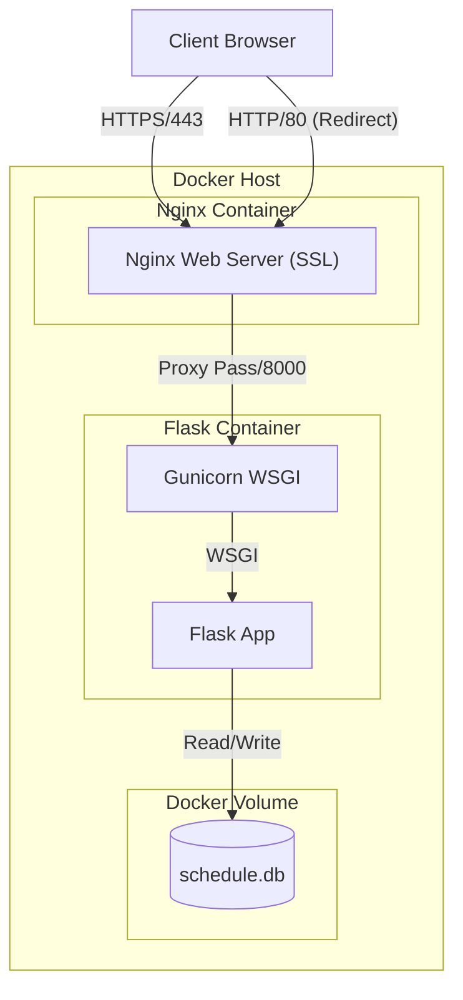

# 기술 요구사항 정의서 (TRD) - 프로젝트 일정 관리 보드

> **💡 교육용 가이드**
> **TRD**(Technical Requirements Document)는 PRD에서 정의한 기능을 **"어떻게(How)"** 구현할지 기술적으로 상세히 정의하는 문서입니다.
> 이 문서를 통해 **시스템 아키텍처 설계의 근거**와 **실무적인 배포 구성**을 학습할 수 있습니다.

## 1. 문서 개요
본 문서는 **Lecture Notice Board** 프로젝트의 기술적 구현 상세, 시스템 아키텍처, 인프라 구성 및 데이터 흐름을 정의합니다.

## 2. 시스템 아키텍처 (System Architecture)

### 2.1. 아키텍처 다이어그램

### 2.2. 컴포넌트 정의
1.  **Nginx (Reverse Proxy & SSL Termination)**
    *   **Role**: HTTPS(443) 요청 처리 및 SSL 복호화, HTTP(80) 요청을 HTTPS로 리다이렉트.
    *   **Config**: `nginx/nginx.conf` 마운트.
2.  **Application Server (WAS)**
    *   **Role**: 비즈니스 로직 처리 및 HTML 렌더링.
    *   **Stack**: Python 3.9, Flask, Gunicorn.
    *   **Execution**: `gunicorn -w 4 -b 0.0.0.0:8000 app:app`
3.  **Database**
    *   **Role**: 데이터 영구 저장.
    *   **Type**: SQLite3 (File-based RDBMS).
    *   **Storage**: Docker Named Volume (`sqlite_data`) 사용.

> **💡 기술적 의사결정 (Why?)**
> *   **Reverse Proxy**: Flask를 직접 노출하지 않고 Nginx를 앞에 두는 이유는 **보안**(직접 공격 차단)과 **성능**(정적 파일 처리, SSL 부하 분산) 때문입니다.
> *   **Gunicorn**: Flask의 내장 개발 서버(`app.run`)는 단일 스레드로 동작하여 동시 요청 처리에 취약합니다. 실무에서는 멀티 프로세스를 지원하는 Gunicorn을 사용합니다.

## 3. 기술 스택 상세 (Technical Stack)

### 3.1. Backend
*   **Language**: Python 3.9-slim (Docker 이미지 크기 최적화)
*   **Web Framework**: Flask 2.x
*   **WSGI Server**: Gunicorn
    *   **Workers**: 4개 (CPU Core * 2 + 1 공식에 기반한 설정)
    *   **Bind**: 0.0.0.0:8000 (컨테이너 외부에서 접근 허용)

> **💡 학습 포인트: Gunicorn Worker**
> *   Worker가 4개라는 것은 동시에 4개의 요청을 병렬로 처리할 수 있다는 뜻입니다.
> *   하나의 요청이 오래 걸려도(Blocking), 다른 Worker가 나머지 요청을 처리하므로 서비스가 멈추지 않습니다.

### 3.2. Database
*   **Engine**: SQLite3
*   **Concurrency**: SQLite는 기본적으로 파일 락(File Lock)을 사용하여 동시 쓰기를 제한합니다. 대규모 트래픽에는 부적합하지만, 본 프로젝트와 같은 소규모/교육용에는 설정이 간편하여 적합합니다.

### 3.3. Frontend
*   **Template Engine**: Jinja2 (Server-side Rendering)
*   **Design**: 별도 CSS 프레임워크 없이 Native CSS 사용 (학습 목적).

## 4. 인프라 및 배포 사양 (Infrastructure & Deployment)

### 4.1. Docker Configuration
*   **Docker Compose Version**: 3.8
*   **Services**:
    *   `web`: Flask 애플리케이션. `restart: always` (장애 시 자동 복구).
    *   `nginx`: 리버스 프록시. `web` 서비스에 의존(`depends_on`).
*   **Networks**: Docker Compose Default Bridge Network.
    *   **Security**: `web` 컨테이너의 8000 포트는 `expose`만 되어 있어, 호스트(외부)에서는 접근 불가능하고 오직 같은 네트워크의 `nginx`만 접근 가능합니다.

> **💡 학습 포인트: Port Mapping vs Expose**
> *   `ports: "80:80"`: 호스트의 80번 포트를 컨테이너의 80번과 연결합니다. (외부 접속 가능)
> *   `expose: "8000"`: Docker 내부 네트워크에서만 8000번을 엽니다. (외부 접속 불가, 보안 강화)

### 4.2. Data Persistence (Storage)
*   **Volume Name**: `sqlite_data`
*   **Mount Point**: `/data` (Container)
*   **Lifecycle**: 컨테이너가 삭제(`docker-compose down`)되어도 볼륨은 삭제되지 않아 데이터가 유지됩니다.

## 5. 보안 요구사항 (Security Specifications)

### 5.1. 환경 변수 관리 (.env)
*   **원칙**: 비밀번호, API 키 등 민감 정보는 절대 코드(`git`)에 포함하지 않습니다.
*   **구현**: `.env` 파일을 통해 컨테이너 실행 시점에 환경 변수로 주입합니다.

### 5.2. 네트워크 보안
*   **SSL/TLS**: Self-Signed Certificate를 사용하여 전송 구간을 암호화합니다. (Sniffing 방지)
*   **Internal Network**: WAS(Flask)를 내부망에 숨겨 직접적인 공격 표면(Attack Surface)을 줄입니다.

### 5.3. 애플리케이션 보안
*   **CSRF Protection**:
    *   Level 1: Session 기반 난수 검증 (`app.py`)
    *   Level 2: Flask-WTF 라이브러리 활용 (`app_WTF.py`)
*   **XSS Protection**: Jinja2 Auto-escaping 활성화 및 `| safe` 필터 사용 제한.

## 6. 성능 및 확장성 (Performance & Scalability)
*   **Vertical Scaling**: Gunicorn Worker 수를 늘려 처리량을 높일 수 있습니다.
*   **Limitation**: SQLite의 특성상 쓰기 작업(Write)이 많은 경우 병목이 발생할 수 있습니다. (추후 PostgreSQL 등으로 마이그레이션 권장)
