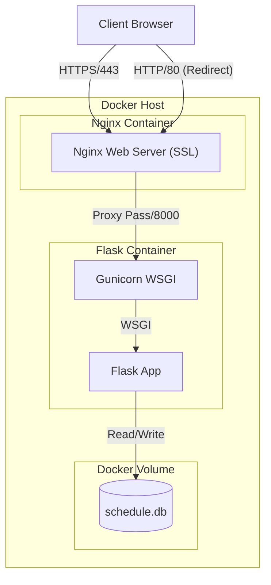

# 기술 요구사항 정의서 (TRD) - 프로젝트 일정 관리 보드

## 1. 문서 개요
본 문서는 **Lecture Notice Board** 프로젝트의 기술적 구현 상세, 시스템 아키텍처, 인프라 구성 및 데이터 흐름을 정의합니다. 개발자 및 시스템 관리자가 시스템의 내부 동작 원리를 이해하고 유지보수하는 데 목적이 있습니다.

## 2. 시스템 아키텍처 (System Architecture)

### 2.1. 아키텍처 다이어그램

### 2.2. 컴포넌트 정의
1.  **Nginx (Reverse Proxy & SSL Termination)**
    *   **Role**: HTTPS(443) 요청 처리 및 SSL 복호화, HTTP(80) 요청을 HTTPS로 리다이렉트.
    *   **Image**: `nginx:latest`
    *   **Config**: `nginx/nginx.conf` 마운트 (`/etc/nginx/conf.d/default.conf`)
    *   **SSL**: Self-Signed Certificate (`nginx/ssl/`) 마운트.
2.  **Application Server (WAS)**
    *   **Role**: 비즈니스 로직 처리 및 HTML 렌더링.
    *   **Stack**: Python 3.9, Flask, Gunicorn.
    *   **Execution**: `gunicorn -w 4 -b 0.0.0.0:8000 app:app` (4 Worker Processes).
3.  **Database**
    *   **Role**: 데이터 영구 저장.
    *   **Type**: SQLite3 (File-based RDBMS).
    *   **Storage**: Docker Named Volume (`sqlite_data`)에 저장되어 컨테이너 수명주기와 분리됨.

## 3. 기술 스택 상세 (Technical Stack)

### 3.1. Backend
*   **Language**: Python 3.9-slim (경량화된 Docker 이미지 사용)
*   **Web Framework**: Flask 2.x
*   **Security**: `secrets` 모듈 (CSRF Token 생성), `werkzeug.exceptions.abort`
*   **WSGI Server**: Gunicorn
    *   **Workers**: 4개 (동시 요청 처리 능력 확보)
    *   **Bind**: 0.0.0.0:8000
*   **Dependencies**: `requirements.txt` 참조 (`Flask`, `python-dotenv`, `gunicorn` 등)

### 3.2. Database
*   **Engine**: SQLite3 (Python Standard Library)
*   **Connection**: `sqlite3.connect()` with `check_same_thread=False` (Gunicorn 멀티 워커 환경 고려 필요하나, SQLite는 파일 락으로 동시성 제어)
*   **Row Factory**: `sqlite3.Row` (컬럼명으로 데이터 접근 가능)

### 3.3. Frontend
*   **Template Engine**: Jinja2 (Server-side Rendering)
*   **Static Files**: CSS/JS는 현재 템플릿 내장 또는 `static/` 디렉토리(확장 가능)

## 4. 인프라 및 배포 사양 (Infrastructure & Deployment)

### 4.1. Docker Configuration
*   **Docker Compose Version**: 3.8
*   **Services**:
    *   `web`: Flask 애플리케이션. `restart: always` 정책 적용.
    *   `nginx`: 리버스 프록시. `web` 서비스에 의존(`depends_on`).
*   **Networks**: Docker Compose Default Bridge Network 사용.
    *   `nginx`와 `web`은 내부 네트워크로 통신.
    *   `web` 컨테이너의 8000 포트는 호스트에 노출하지 않음 (`expose`만 사용).

### 4.2. Data Persistence (Storage)
*   **Volume Name**: `sqlite_data`
*   **Mount Point**:
    *   Container: `/data`
    *   Host: Docker managed volume path (`/var/lib/docker/volumes/...`)
*   **File Path**:
    *   App Config: `DB_PATH=/data/schedule.db`

## 5. 보안 요구사항 (Security Specifications)

### 5.1. 환경 변수 관리
민감 정보는 소스 코드에서 분리하여 `.env` 파일로 관리하며, Docker 컨테이너 실행 시 주입됩니다.
*   **필수 변수**:
    *   `FLASK_SECRET_KEY`: 세션 서명 및 CSRF 토큰 생성용 키.
    *   `ADMIN_PASSWORD`: 관리자 로그인 비밀번호.
    *   `DB_PATH`: 데이터베이스 파일 경로 (운영 환경: `/data/schedule.db`).

### 5.2. 네트워크 보안
*   **Port Exposure**: 오직 Nginx의 **80번**(HTTP)과 **443번**(HTTPS) 포트만 호스트(외부)에 노출됩니다. 
*   **Internal Communication**: Flask(8000)는 내부 네트워크에서만 접근 가능하여 직접적인 외부 공격을 차단합니다.
*   **SSL/TLS**: Self-Signed Certificate를 적용하여 전송 계층 암호화를 수행합니다.

### 5.3. 애플리케이션 보안
*   **CSRF Protection**: 중요 상태 변경 요청(삭제 등)에 대해 CSRF Token 검증을 수행합니다.
*   **Secure Cookies**: `SameSite=Lax`, `Secure`, `HttpOnly` 속성을 적용하여 쿠키 탈취 및 CSRF 위험을 완화합니다.

## 6. 인터페이스 설계 (Interface Design)

### 6.1. Internal API (Flask Routes)
| Route | Method | Description | Parameters |
| :--- | :--- | :--- | :--- |
| `/` | GET | 메인 페이지 렌더링 | None |
| `/login` | POST | 관리자 인증 | `password` (Form) |
| `/admin` | GET | 관리자 페이지 렌더링 | Session Cookie |
| `/create` | POST | 게시글 생성 | `category`, `title`, `content` |
| `/edit/<id>` | GET/POST | 게시글 수정 | `id` (Path), Form Data |
| `/delete/<id>` | POST | 게시글 삭제 | `id` (Path) |

## 7. 개발 및 운영 환경 (Environment)

### 7.1. Local Development
*   **Run**: `python app.py`
*   **DB Path**: `./schedule.db` (프로젝트 루트)
*   **Server**: Flask Development Server (Single Thread)

### 7.2. Production (Docker)
*   **Run**: `docker-compose up -d`
*   **DB Path**: `/data/schedule.db` (Volume Mount)
*   **Server**: Gunicorn (Multi-process) + Nginx

## 8. 유지보수 및 모니터링
*   **Logs**: `docker-compose logs -f` 명령어로 Nginx 및 Gunicorn 로그 통합 확인.
*   **Backup**: `sqlite_data` 볼륨 백업 또는 `/data/schedule.db` 파일 복사.
*   **Scaling**: 현재 구조는 단일 노드 배포에 최적화됨. 수평 확장(Scale-out) 시 SQLite의 파일 락 한계로 인해 DB 마이그레이션(MySQL/PostgreSQL) 필요.
