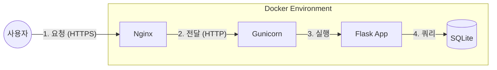

# [학습자료] Flask 실무 배포 아키텍처 이해하기

이 문서는 우리가 프로젝트에 적용한 **Docker + Nginx + Gunicorn + Flask** 아키텍처가 왜 필요한지, 그리고 각 컴포넌트가 어떤 역할을 하는지 설명하는 학습 자료입니다.

## 1. 왜 `python app.py`로 배포하면 안 될까?

우리가 개발할 때는 터미널에서 `python app.py`를 입력하여 Flask 내장 서버(Werkzeug)를 실행했습니다. 하지만 이 방식은 **실제 서비스(Production)** 환경에서는 절대 사용해서는 안 됩니다.

### 1.1. Flask 내장 서버의 한계
1.  **성능 문제**: 기본적으로 한 번에 하나의 요청만 처리하거나, 동시 처리 능력이 매우 떨어집니다. (Single Threaded)
2.  **보안 취약**: 전문적인 웹 서버가 아니므로, 외부 공격(DDoS, Slowloris 등)에 대한 방어책이 없습니다.
3.  **기능 부족**: HTTPS(SSL) 적용, 정적 파일 캐싱, 로드 밸런싱 등의 고급 기능을 제공하지 않습니다.

따라서 실무에서는 **전문적인 역할 분담**을 통해 안정적인 서비스를 구축합니다.

---

## 2. 우리가 채택한 아키텍처 (Architecture)

이 프로젝트는 **"Nginx(웹 서버) + Gunicorn(WAS) + Flask(애플리케이션)"** 조합을 사용하며, 이를 **Docker** 컨테이너로 묶어서 배포합니다.



### 2.1. 각 컴포넌트의 역할 (Role)

| 컴포넌트 | 역할 비유 | 실제 역할 | 왜 필요한가? |
| :--- | :--- | :--- | :--- |
| **Nginx** | **문지기/안내원** | Web Server (Reverse Proxy) | HTTPS 암호화 처리, 정적 파일(이미지/CSS) 고속 전송, 보안 방어 |
| **Gunicorn** | **지배인** | WSGI Server (Middleware) | 여러 개의 Flask 프로세스(Worker)를 관리하여 **동시 접속** 처리 |
| **Flask** | **요리사** | Web Application | 실제 Python 코드를 실행하여 데이터 처리 및 로직 수행 |
| **Docker** | **푸드트럭** | Container Platform | 서버 환경(OS, 라이브러리 등)을 통째로 포장하여 어디서든 똑같이 실행되게 함 |

---

## 3. 상세 기술 설명

### 3.1. WSGI란 무엇인가?
**WSGI**(Web Server Gateway Interface)는 Python 웹 애플리케이션(Flask, Django)과 웹 서버(Nginx, Apache)가 서로 통신하기 위한 **표준 인터페이스**입니다.
*   Nginx는 Python 코드를 직접 이해하지 못합니다.
*   Gunicorn이 Nginx의 요청을 받아 Python이 이해할 수 있는 형태로 변환(WSGI)하여 Flask에게 넘겨줍니다.

### 3.2. Gunicorn 설정의 의미
`docker-compose.yml`이나 `Dockerfile`을 보면 다음과 같은 실행 명령어가 있습니다.

```bash
gunicorn -w 4 -b 0.0.0.0:8000 app:app
```

*   **`-w 4` (Workers)**: 요리사를 4명 두겠다는 뜻입니다. 동시에 4개의 요청을 처리할 수 있습니다. (보통 CPU 코어 수 * 2 + 1 권장)
*   **`-b 0.0.0.0:8000` (Bind)**: 8000번 포트에서 요청을 기다리겠다는 뜻입니다.
*   **`app:app`**: `app.py` 파일 안에 있는 `app` 변수(Flask 객체)를 실행하라는 뜻입니다.

### 3.3. Nginx의 리버스 프록시 (Reverse Proxy)
Nginx는 사용자의 요청을 대신 받아서 뒤에 있는 Gunicorn에게 전달합니다. 이를 **리버스 프록시**라고 합니다.
*   사용자는 내부의 Gunicorn(8000번)에 직접 접근할 수 없습니다.
*   오직 Nginx(80/443번)를 통해서만 접근 가능하므로 보안이 강화됩니다.

---

## 4. 결론

이 아키텍처는 Python 웹 개발의 **업계 표준**(De Facto Standard)입니다.
이번 프로젝트를 통해 단순히 코드를 짜는 것을 넘어, **"내 코드가 실제 서버에서 어떻게 안전하게 실행되는지"** 전체 그림을 이해하는 것이 목표입니다.
