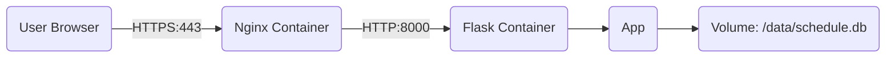

# [실습] Flask + SQLite + Docker로 만드는 프로젝트 일정 관리 보드

4개월 차 초급 개발자 양성과정 학생들을 위한 **[Flask와 SQLite를 활용한 프로젝트 일정 관리 보드 만들기]** 강의 교안입니다.

기존의 단순한 Flask 실행 방식을 넘어, **Docker, Nginx, Gunicorn**을 활용한 **실무 수준의 배포 아키텍처**를 학습할 수 있도록 구성되었습니다.

---

## 1. 개요 및 학습 목표

우리는 지금까지 Flask와 MySQL을 연동하여 게시판을 만들어 보았습니다. 이번 프로젝트에서는 **SQLite**를 사용하여 가볍게 데이터베이스를 구성하고, **Docker**를 이용해 컨테이너 기반으로 애플리케이션을 배포하는 방법을 배웁니다.

**학습 목표:**
1.  **SQLite와 MySQL의 차이점**을 이해한다.
2.  **Docker**와 **Docker Compose**를 사용하여 애플리케이션을 컨테이너화한다.
3.  **Nginx**(Web Server)와 **Gunicorn**(WSGI)을 연동하여 안정적인 서비스 아키텍처를 구축한다.
4.  **환경 변수**(.env)를 사용하여 민감한 정보를 안전하게 관리하는 방법을 익힌다.
5.  **Docker Volume**을 통해 컨테이너가 재시작되어도 데이터를 유지하는 방법을 익힌다.

---

## 2. 배포 아키텍처 (Production Architecture)

단순히 `python app.py`로 실행하는 개발 서버와 달리, 실제 서비스 환경은 다음과 같이 구성됩니다.



1.  **Nginx**: 사용자의 요청을 가장 먼저 받는 웹 서버입니다. **HTTPS(443)** 요청을 처리하고 **HTTP(80)** 요청을 HTTPS로 리다이렉트합니다.
2.  **Gunicorn**: Python WSGI 서버로, 여러 요청을 동시에 안정적으로 처리할 수 있도록 Flask 앱을 실행합니다.
3.  **Flask**: 실제 비즈니스 로직을 처리하는 애플리케이션입니다. **Secure Cookie** 설정을 통해 세션 보안을 강화했습니다.
4.  **SQLite**: 파일 기반 데이터베이스로, Docker Volume을 통해 데이터를 영구 저장합니다.

---

## 3. SQLite란 무엇인가? (MySQL과 비교)

| 특징 | MySQL (Server-based) | SQLite (Serverless) |
| :--- | :--- | :--- |
| **구조** | 클라이언트 <-> **DB 서버 프로세스** <-> 데이터 파일 | 프로그램 <-> **파일 직접 접근** (`.db`) |
| **설치** | 별도 설치 필요 (복잡함) | **설치 불필요** (Python 내장) |
| **동시성** | 다중 사용자 동시 접속에 최적화 | 단일 사용자 또는 적은 트래픽에 적합 |
| **용도** | 웹 서비스, 대규모 데이터 처리 | 모바일 앱, 임베디드, 프로토타입, 소규모 웹 |

> **핵심:** SQLite는 데이터베이스가 하나의 **파일**로 존재합니다. Docker 환경에서는 이 파일을 컨테이너가 사라져도 유지하기 위해 **Volume** 설정이 필수적입니다.

---

## 4. 프로젝트 구조

```text
lecture_notice/
├── .github/            # GitHub 관련 설정
├── docs/               # 프로젝트 문서 (배포 가이드, 리서치 노트, 보안 점검)
├── nginx/
│   ├── nginx.conf      # Nginx 리버스 프록시 설정
│   └── ssl/            # SSL 인증서 저장소 (Git 제외)
├── templates/          # HTML 템플릿 파일들
├── .env.example        # 환경 변수 예시 파일
├── .gitignore          # Git 제외 파일 목록
├── app.py              # Flask 애플리케이션 로직
├── Dockerfile          # Flask 앱 이미지 빌드 설정
├── docker-compose.yml  # Nginx와 Flask 컨테이너 오케스트레이션
├── requirements.txt    # Python 의존성 목록
└── readme.md           # 프로젝트 설명
```

### 4.1. 상세 문서 목록 (Documents)
`docs/` 폴더에는 프로젝트의 기획, 설계, 배포, 보안, 트러블슈팅에 관한 상세 문서가 포함되어 있습니다.

#### 기획 및 설계
*   **[제품 요구사항 정의서 (PRD)](docs/prd.md)**: 프로젝트의 목적, 사용자 대상, 핵심 기능 정의.
*   **[기술 요구사항 정의서 (TRD)](docs/trd.md)**: 시스템 아키텍처, 데이터베이스 스키마, API 명세 등 기술적 상세.
*   **[프로젝트 분석 보고서](docs/PROJECT_REPORT.md)**: 프로젝트 코드 및 아키텍처 분석, 교육 자료로서의 적합성 평가.

#### 배포 및 인프라
*   **[배포 가이드](docs/Deployment_Guide.md)**: Docker, Nginx, Gunicorn을 이용한 배포 방법 및 환경 설정 가이드.
*   **[Flask 배포 아키텍처 리서치](docs/리서치_Flask_배포_아키텍처.md)**: Flask 실무 배포를 위한 기술 스택 선정 근거 및 리서치 내용.
*   **[트러블슈팅: mDNS 접속 오류](docs/분석보고_mdns_접속_오류.md)**: 로컬 네트워크(.local) 접속 문제 원인 분석 및 해결 사례.

#### 보안 가이드
*   **[보안점검: 게시글 삭제 취약점](docs/보안점검_게시글_삭제.md)**: GET 방식 삭제의 위험성 분석 및 개선 방안.
*   **[가이드: Flask-WTF CSRF 적용](docs/가이드_Flask_WTF_CSRF_적용.md)**: Flask-WTF 라이브러리를 활용한 심화 CSRF 보안 적용 가이드.
*   **[보안점검: 세션 탈취](docs/보안점검_세션_탈취.md)**: 세션 하이재킹 위험성 및 Secure Cookie 설정 가이드.

---

## 5. 실행 방법 (How to Run)

### 5.1. 네트워크 환경 구성 (mDNS) - 선택 사항
이 프로젝트는 내부망(Local Network)에서 IP 주소가 바뀌더라도 고정된 도메인 이름으로 서버에 접속하기 위해 **mDNS**(Multicast DNS)를 활용합니다.

*   **사용 이유**: 공유기를 사용하는 일반적인 환경(DHCP)에서는 서버 재부팅 시 IP가 바뀔 수 있어 접속이 불편합니다. mDNS를 설정하면 `서버이름.local`이라는 고정된 주소로 항상 접속할 수 있습니다.
*   **설치 방법 (Ubuntu/Debian 기준)**:
    ```bash
    # 1. 현재 서버의 호스트 이름 확인
    hostname
    # (예: 결과가 'myserver'라면 접속 주소는 'https://myserver.local'이 됩니다.)

    # 2. Avahi 데몬(mDNS 서비스) 설치 및 실행
    sudo apt update
    sudo apt install avahi-daemon -y
    sudo systemctl enable --now avahi-daemon
    ```

### 5.2. 사전 준비 (Prerequisites)
*   **Docker** & **Docker Compose** 설치
*   **OpenSSL** (SSL 인증서 생성용)

### 5.3. 환경 설정 및 인증서 생성 (필수)

프로젝트 실행 전, 환경 변수 설정과 SSL 인증서 생성이 반드시 필요합니다.

1.  **환경 변수 설정**
    ```bash
    cp .env.example .env
    # 필요 시 .env 파일을 열어 비밀번호 수정
    ```

2.  **SSL 인증서 생성 (Self-Signed)**
    Nginx가 HTTPS를 처리하기 위해 인증서가 필요합니다.
    아래 명령어의 `myserver` 부분을 **여러분의 실제 호스트 이름**으로 변경하여 실행하세요.
    ```bash
    mkdir -p nginx/ssl
    
    # 'myserver'를 실제 hostname으로 변경하세요 (예: n100 -> n100.local)
    openssl req -x509 -nodes -days 365 -newkey rsa:2048 \
      -keyout nginx/ssl/server.key \
      -out nginx/ssl/server.crt \
      -subj "/CN=myserver.local" \
      -addext "subjectAltName=DNS:myserver.local,DNS:*.local,IP:127.0.0.1"
    ```

### 5.4. Docker Compose로 실행 (권장)

1.  **컨테이너 빌드 및 실행**
    ```bash
    docker-compose up -d --build
    ```
2.  **접속 확인**
    *   브라우저에서 `https://myserver.local` (여러분의 호스트 이름) 로 접속합니다.
    *   자가 서명 인증서이므로 "안전하지 않음" 경고가 뜰 수 있습니다. (고급 -> 이동 선택)
3.  **로그 확인**
    ```bash
    docker-compose logs -f
    ```
4.  **서비스 중지**
    ```bash
    docker-compose down
    ```

### 5.5. 로컬 Python 환경에서 실행 (개발용)

Docker 없이 개발 테스트를 하려면 다음과 같이 실행합니다.

1.  **의존성 설치**
    ```bash
    pip install -r requirements.txt
    ```
2.  **앱 실행**
    ```bash
    python app.py
    ```
3.  **접속 확인**
    브라우저에서 `http://localhost:5000` 으로 접속합니다.

---

## 6. 주요 코드 설명

### 6.1. 데이터베이스 경로 처리 (`app.py`)
Docker 환경과 로컬 환경 모두에서 작동하도록 환경 변수를 사용합니다.

```python
import os
from dotenv import load_dotenv

load_dotenv() # .env 파일 로드

# 환경 변수 DB_PATH가 있으면 사용하고, 없으면 기본값 'schedule.db' 사용
DB_PATH = os.environ.get('DB_PATH', 'schedule.db')
```

### 6.2. 환경 변수 및 보안 (`app.py`)
비밀번호나 시크릿 키와 같은 민감한 정보는 소스 코드에 하드코딩하지 않고 환경 변수로 관리합니다.

```python
# .env 파일에서 값을 가져옴
app.secret_key = os.environ.get('FLASK_SECRET_KEY', 'dev_key')
admin_password = os.environ.get('ADMIN_PASSWORD', 'admin')
```

### 6.3. Docker Volume 설정 (`docker-compose.yml`)
SQLite 데이터 파일이 컨테이너 삭제 시 함께 사라지지 않도록 볼륨을 마운트합니다.

```yaml
services:
  web:
    # ...
    environment:
      - DB_PATH=/data/schedule.db  # 앱이 참조할 경로
    volumes:
      - sqlite_data:/data          # 호스트의 볼륨을 컨테이너의 /data에 연결

volumes:
  sqlite_data:                     # 도커 볼륨 정의
```

### 6.4. 데이터베이스 초기화 (`app.py`)
앱이 시작될 때 테이블이 없으면 자동으로 생성하고 초기 데이터를 주입합니다.

```python
# 앱 실행 시 1회 수행
with app.app_context():
    init_db()
```

> **주의:** SQLite의 자료형은 MySQL보다 단순합니다. `VARCHAR` 대신 `TEXT`, `INT` 대신 `INTEGER`를 주로 사용합니다.

---

## 7. CRUD 구현 포인트

### 7.1. 조회 (Read) - 카테고리별 그룹화

DB에서 가져온 데이터를 Python 리스트 컴프리헨션이나 딕셔너리를 이용해 가공하는 연습을 해봅시다.

```python
@app.route('/')
def index():
    conn = get_db_connection()
    # fetchall()은 리스트 안에 Row 객체들을 반환
    posts = conn.execute('SELECT * FROM posts').fetchall()
    conn.close()
    
    # Python 레벨에서 데이터 가공 (카테고리별 분류)
    grouped_posts = {}
    for post in posts:
        cat = post['category']
        if cat not in grouped_posts:
            grouped_posts[cat] = []
        grouped_posts[cat].append(post)
            
    return render_template('index.html', grouped_posts=grouped_posts)
```

### 7.2. 생성 (Create) - 파라미터 바인딩

SQL 인젝션 공격을 막기 위해 **반드시 파라미터 바인딩**을 사용해야 합니다.
*   MySQL: `VALUES (%s, %s, %s)`
*   SQLite: `VALUES (?, ?, ?)` (**물음표 사용**)

```python
conn.execute('INSERT INTO posts (category, title, content) VALUES (?, ?, ?)',
             (category, title, content))
conn.commit()
```

### 7.3. 수정 (Update)과 삭제 (Delete)

수정과 삭제는 `WHERE` 절을 통해 특정 `id`만 타겟팅합니다.

```python
# 수정 (UPDATE)
conn.execute('UPDATE posts SET category = ?, title = ?, content = ? WHERE id = ?',
             (category, title, content, id))

# 삭제 (DELETE)
conn.execute('DELETE FROM posts WHERE id = ?', (id,))
```

---

## 8. 관리자 기능 (Session)

간단한 인증을 위해 Flask의 `session`을 사용합니다. 보안을 위해 비밀번호는 소스 코드에 하드코딩하지 않고 **환경 변수**(.env)를 통해 관리합니다.

```python
@app.route('/login', methods=['POST'])
def login():
    # 환경 변수에서 비밀번호를 가져와 비교 (기본값: 'admin')
    admin_password = os.environ.get('ADMIN_PASSWORD', 'admin')
    
    if request.form['password'] == admin_password:
        session['logged_in'] = True
        return redirect(url_for('admin'))
    # ...
```

---

## 9. 화면 구현 (Jinja2 Template)

Jinja2 템플릿 엔진을 사용하여 줄바꿈(`\n`)이 있는 텍스트를 그대로 보여주기 위해 `<pre>` 태그를 활용합니다.

```html
<!-- index.html 예시 -->

    <h2>{{ cat }}</h2>
    
        <div class="card">
            <h3>{{ post.title }}</h3>
            <!-- 줄바꿈 보존을 위해 pre 태그 사용 -->
            <pre>{{ post.content }}</pre>
        </div>
    

```

---

## 10. 실습 과제

제공된 소스 코드를 실행하여 다음 기능을 직접 확인하고 수정해 보세요.

1.  **초기 데이터 확인:** 앱 실행 후 브라우저에서 '수업 공지', '팀 구성' 데이터가 잘 나오는지 확인합니다.
2.  **데이터 수정:** 관리자 페이지에 접속하여 'B team'의 팀원 이름을 수정해 봅니다. (비밀번호는 `.env` 파일의 `ADMIN_PASSWORD` 값을 확인하세요.)
3.  **스키마 변경 (심화):**
    *   `posts` 테이블에 `created_at` 컬럼(작성일)을 추가해 봅니다.
    *   (주의: SQLite는 `ALTER TABLE` 기능이 제한적이므로, DB 파일을 삭제하고 `init_db` 코드를 수정한 뒤 재시작하는 것이 가장 빠릅니다.)

## 11. 보안 및 HTTPS 설정 (Security)

이 프로젝트는 내부망 환경에서의 보안을 위해 **Self-Signed Certificate**(자가 서명 인증서)를 사용한 HTTPS를 적용했습니다.

### 11.1. 브라우저 경고창 처리
자가 서명 인증서를 사용하므로 브라우저 접속 시 **"주의 요함"** 또는 **"안전하지 않음"** 경고가 뜹니다. 이는 인증서 발급 기관(CA)이 공인된 곳이 아니기 때문이며, 내부망 통신 암호화 자체는 정상적으로 동작합니다.
*   **Chrome/Edge**: `고급` 버튼 클릭 -> `localhost(으)로 이동(안전하지 않음)` 클릭

### 11.2. IP 주소 및 mDNS(.local) 지원 인증서 재발급하기
기본 설정은 `localhost`와 `*.local` 도메인을 지원하도록 되어 있습니다.
만약 특정 IP(예: 192.168.0.10)나 특정 mDNS 이름(예: myserver.local)을 명시하여 인증서를 새로 만들려면 아래 명령어를 사용하세요.

```bash
# 예: 서버 IP가 192.168.0.10 이고, mDNS 이름이 myserver.local 인 경우
mkdir -p nginx/ssl
openssl req -x509 -nodes -days 365 -newkey rsa:2048 \
  -keyout nginx/ssl/server.key \
  -out nginx/ssl/server.crt \
  -subj "/CN=myserver.local" \
  -addext "subjectAltName=DNS:myserver.local,DNS:*.local,IP:192.168.0.10"

# 컨테이너 재시작
docker-compose restart nginx
```

### 11.3. CSRF 보호 (Cross-Site Request Forgery)
게시글 삭제와 같은 중요 기능에는 CSRF 공격을 방지하기 위해 **CSRF Token** 검증 로직이 적용되어 있습니다.
*   **Backend**: `secrets` 모듈로 생성한 난수 토큰을 세션에 저장하고, POST 요청 시 검증합니다.
*   **Frontend**: Form 전송 시 hidden input으로 토큰을 함께 전송합니다.

> **[심화 학습]** 표준 라이브러리인 **Flask-WTF**를 사용하여 더 강력한 보안을 적용하는 방법은 **[가이드: Flask-WTF를 이용한 강력한 CSRF 보호 적용](docs/가이드_Flask_WTF_CSRF_적용.md)** 문서를 참고하세요.

## 12. (참고) 실제 도메인 및 공인 IP 배포 시 고려사항

본 실습은 내부망(Intranet) 환경을 가정하여 mDNS와 자가 서명 인증서를 사용했습니다. 하지만 실제 서비스를 인터넷에 배포하여 누구나 접속하게 하려면 다음과 같은 변경이 필요합니다.

### 12.1. 도메인 구입 및 DNS 설정
*   **도메인**: 가비아, AWS Route53, Godaddy 등에서 실제 도메인(예: `example.com`)을 구입해야 합니다.
*   **DNS 레코드**: 구입한 도메인의 DNS 설정에서 **A 레코드**를 서버의 **공인 IP**(Public IP)로 연결해야 합니다.
    *   mDNS(`*.local`)는 내부망 전용이므로 인터넷 환경에서는 작동하지 않습니다.

### 12.2. 공인 인증서 발급 (Let's Encrypt)
자가 서명 인증서(`openssl`)는 브라우저 경고가 뜨므로, 실제 서비스에는 적합하지 않습니다. 무료로 사용할 수 있는 **Let's Encrypt**를 권장합니다.

*   **Certbot 사용**: `openssl` 대신 `certbot` 도구를 사용하여 신뢰할 수 있는 인증서를 발급받습니다.
*   **Nginx 설정 변경**:
    ```nginx
    server_name example.com; # 실제 도메인으로 변경
    
    # Let's Encrypt 인증서 경로 예시
    ssl_certificate /etc/letsencrypt/live/example.com/fullchain.pem;
    ssl_certificate_key /etc/letsencrypt/live/example.com/privkey.pem;
    ```

### 12.3. 네트워크 구성 변화
*   **mDNS 제거**: 공인 DNS를 사용하므로 `avahi-daemon` 설치 과정은 불필요합니다.
*   **포트 포워딩**: 서버가 공유기 뒤(사설망)에 있다면, 공유기 설정에서 **80번**(HTTP)과 **443번**(HTTPS) 포트를 서버 IP로 포트 포워딩(Port Forwarding) 해야 외부에서 접속 가능합니다.

## 13. 마치며

이번 실습을 통해 여러분은 **서버가 필요 없는 데이터베이스** 환경을 구축했습니다.
이 방식은 현업에서 **설정 정보 저장, 로그 관리, 임시 데이터 캐싱, 혹은 모바일 앱 내부 저장소**로 매우 빈번하게 사용됩니다.

MySQL과 SQL 문법은 거의 같지만, 환경 구성이 얼마나 간편해졌는지 체감해 보시기 바랍니다.
