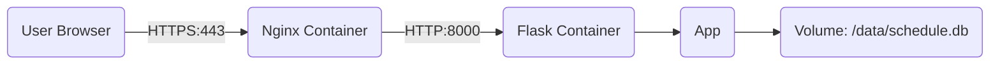

# [실습] Flask + SQLite + Docker로 만드는 프로젝트 일정 관리 보드

4개월 차 초급 개발자 양성과정 학생들을 위한 **[Flask와 SQLite를 활용한 프로젝트 일정 관리 보드 만들기]** 강의 교안입니다.

기존의 단순한 Flask 실행 방식을 넘어, **Docker, Nginx, Gunicorn**을 활용한 **실무 수준의 배포 아키텍처**를 학습할 수 있도록 구성되었습니다. 또한, **단계별 보안 적용(CSRF Protection)**(CSRF Protection)을 통해 웹 보안의 기초부터 심화까지 학습합니다.

---

## 1. 개요 및 학습 목표

우리는 지금까지 Flask와 MySQL을 연동하여 게시판을 만들어 보았습니다. 이번 프로젝트에서는 **SQLite**를 사용하여 가볍게 데이터베이스를 구성하고, **Docker**를 이용해 컨테이너 기반으로 애플리케이션을 배포하는 방법을 배웁니다.

**학습 목표:**
1.  **SQLite와 MySQL의 차이점**을 이해한다.
2.  **Docker**와 **Docker Compose**를 사용하여 애플리케이션을 컨테이너화한다.
3.  **Nginx**(Web Server)와 **Gunicorn**(WSGI)을 연동하여 안정적인 서비스 아키텍처를 구축한다.
4.  **환경 변수**(.env)를 사용하여 민감한 정보를 안전하게 관리하는 방법을 익힌다.
5.  **웹 보안**(CSRF)의 개념을 이해하고, 수동 구현과 라이브러리(`Flask-WTF`) 사용법을 비교 학습한다.

---

## 2. 배포 아키텍처 (Production Architecture)

단순히 `python app.py`로 실행하는 개발 서버와 달리, 실제 서비스 환경은 다음과 같이 구성됩니다.



1.  **Nginx**: 사용자의 요청을 가장 먼저 받는 웹 서버입니다. **HTTPS(443)** 요청을 처리하고 **HTTP(80)** 요청을 HTTPS로 리다이렉트합니다.
2.  **Gunicorn**: Python WSGI 서버로, 여러 요청을 동시에 안정적으로 처리할 수 있도록 Flask 앱을 실행합니다.
3.  **Flask**: 실제 비즈니스 로직을 처리하는 애플리케이션입니다. **Secure Cookie** 설정을 통해 세션 보안을 강화했습니다.
4.  **SQLite**: 파일 기반 데이터베이스로, Docker Volume을 통해 데이터를 영구 저장합니다.

> **SQLite란?**
> MySQL처럼 별도의 서버 프로세스가 필요 없는 **파일 기반 데이터베이스**입니다. 설정이 간편하여 모바일 앱, 임베디드 시스템, 소규모 웹 서비스에 널리 사용됩니다. Docker 환경에서는 컨테이너가 삭제되어도 데이터가 유지되도록 **Volume** 설정이 필수적입니다.

---

## 3. 프로젝트 구조

```text
lecture_notice/
├── .github/            # GitHub 관련 설정 (Git 제외)
├── docs/               # 프로젝트 문서 (배포 가이드, 리서치 노트, 보안 점검)
├── nginx/
│   ├── nginx.conf      # Nginx 리버스 프록시 설정
│   └── ssl/            # SSL 인증서 저장소 (Git 제외)
├── templates/          # [Level 1] 기본 버전용 HTML 템플릿
├── templates_wtf/      # [Level 2] Flask-WTF 적용 버전용 HTML 템플릿
├── .env.example        # 환경 변수 예시 파일
├── .gitignore          # Git 제외 파일 목록
├── app.py              # [Level 1] 기본 Flask 애플리케이션 (수동 CSRF)
├── app_WTF.py          # [Level 2] 심화 Flask 애플리케이션 (Flask-WTF)
├── Dockerfile          # Flask 앱 이미지 빌드 설정
├── docker-compose.yml  # Nginx와 Flask 컨테이너 오케스트레이션
├── requirements.txt    # Python 의존성 목록
└── readme.md           # 프로젝트 설명
```

---

## 4. 실행 방법 (How to Run)

이 프로젝트는 **Docker를 이용한 배포 실습**과 **로컬 Python 환경에서의 개발 실습** 두 가지 방식을 모두 지원합니다.

### 4.1. 사전 준비 (공통)

1.  **환경 변수 설정**
    ```bash
    cp .env.example .env
    # 필요 시 .env 파일을 열어 비밀번호 수정
    ```

2.  **SSL 인증서 생성 (Docker 실행 시 필수)**
    Nginx가 HTTPS를 처리하기 위해 인증서가 필요합니다.
    ```bash
    mkdir -p nginx/ssl
    
    # 'myserver.local' 부분을 본인의 환경에 맞게 수정하세요.
    openssl req -x509 -nodes -days 365 -newkey rsa:2048 \
      -keyout nginx/ssl/server.key \
      -out nginx/ssl/server.crt \
      -subj "/CN=myserver.local" \
      -addext "subjectAltName=DNS:myserver.local,DNS:*.local,IP:127.0.0.1"
    ```

### 4.2. Docker Compose로 실행 (권장)

실무와 가장 유사한 환경입니다. 기본적으로 `app.py`가 실행됩니다.

1.  **컨테이너 빌드 및 실행**
    ```bash
    docker-compose up -d --build
    ```
2.  **접속 확인**
    *   브라우저에서 `https://myserver.local` (또는 설정한 호스트 이름) 로 접속합니다.
    *   자가 서명 인증서 경고가 뜨면 `고급 -> 이동`을 선택하여 진행합니다.

### 4.3. 로컬 Python 환경에서 실행 (개발용)

Docker 없이 빠르게 코드를 수정하고 테스트할 때 유용합니다.

1.  **의존성 설치**
    ```bash
    pip install -r requirements.txt
    ```

2.  **버전 선택 실행**
    *   **Level 1 (기본)**: 수동 CSRF 검증 로직을 학습합니다.
        ```bash
        python app.py
        ```
    *   **Level 2 (심화)**: Flask-WTF 라이브러리를 이용한 표준 보안 적용을 학습합니다.
        ```bash
        python app_WTF.py
        ```

3.  **접속 확인**
    *   브라우저에서 `http://localhost:5000` 으로 접속합니다.

---

## 5. 단계별 보안 학습 (Security Levels)

이 프로젝트는 보안 기능을 단계적으로 학습할 수 있도록 구성되어 있습니다.

### Level 1: 수동 CSRF 방어 (`app.py`)
*   **원리**: `secrets` 모듈로 난수를 생성하여 세션에 저장하고, POST 요청 시 Form에서 넘어온 값과 비교합니다.
*   **학습 포인트**: CSRF 공격의 원리와 방어 메커니즘을 코드로 직접 구현하며 이해합니다.
*   **관련 문서**: **[보안점검: 게시글 삭제 취약점](docs/보안점검_게시글_삭제.md)**

### Level 2: Flask-WTF 라이브러리 적용 (`app_WTF.py`)
*   **원리**: Python Flask 생태계의 표준 라이브러리인 `Flask-WTF`를 사용하여 체계적으로 보안을 적용합니다.
*   **학습 포인트**: 실무에서 사용하는 표준 라이브러리의 사용법과 자동화된 보안 기능의 편리함을 체감합니다.
*   **관련 문서**: **[가이드: Flask-WTF CSRF 적용](docs/가이드_Flask_WTF_CSRF_적용.md)**

---

## 6. 상세 문서 목록 (Documents)

`docs/` 폴더에는 프로젝트의 기획, 설계, 배포, 보안, 트러블슈팅에 관한 상세 문서가 포함되어 있습니다.

#### 기획 및 설계
*   **[제품 요구사항 정의서 (PRD)](docs/prd.md)**: 프로젝트의 목적, 사용자 대상, 핵심 기능 정의.
*   **[기술 요구사항 정의서 (TRD)](docs/trd.md)**: 시스템 아키텍처, 데이터베이스 스키마, API 명세 등 기술적 상세.
*   **[프로젝트 분석 보고서](docs/PROJECT_REPORT.md)**: 프로젝트 코드 및 아키텍처 분석, 교육 자료로서의 적합성 평가.

#### 배포 및 인프라
*   **[배포 가이드](docs/Deployment_Guide.md)**: Docker, Nginx, Gunicorn을 이용한 배포 방법 및 환경 설정 가이드.
*   **[Flask 배포 아키텍처 리서치](docs/리서치_Flask_배포_아키텍처.md)**: Flask 실무 배포를 위한 기술 스택 선정 근거 및 리서치 내용.
*   **[트러블슈팅: mDNS 접속 오류](docs/분석보고_mdns_접속_오류.md)**: 로컬 네트워크(.local) 접속 문제 원인 분석 및 해결 사례.

#### 보안 가이드
*   **[보안점검: 게시글 삭제 취약점](docs/보안점검_게시글_삭제.md)**: GET 방식 삭제의 위험성 분석 및 개선 방안.
*   **[가이드: Flask-WTF CSRF 적용](docs/가이드_Flask_WTF_CSRF_적용.md)**: Flask-WTF 라이브러리를 활용한 심화 CSRF 보안 적용 가이드.
*   **[보안점검: 세션 탈취](docs/보안점검_세션_탈취.md)**: 세션 하이재킹 위험성 및 Secure Cookie 설정 가이드.

---

## 7. 주요 코드 설명

### 7.1. 데이터베이스 경로 처리 (`app.py`)
Docker 환경과 로컬 환경 모두에서 작동하도록 환경 변수를 사용합니다.

```python
import os
from dotenv import load_dotenv

load_dotenv() # .env 파일 로드

# 환경 변수 DB_PATH가 있으면 사용하고, 없으면 기본값 'schedule.db' 사용
DB_PATH = os.environ.get('DB_PATH', 'schedule.db')
```

### 7.2. Docker Volume 설정 (`docker-compose.yml`)
SQLite 데이터 파일이 컨테이너 삭제 시 함께 사라지지 않도록 볼륨을 마운트합니다.

```yaml
services:
  web:
    # ...
    environment:
      - DB_PATH=/data/schedule.db  # 앱이 참조할 경로
    volumes:
      - sqlite_data:/data          # 호스트의 볼륨을 컨테이너의 /data에 연결

volumes:
  sqlite_data:                     # 도커 볼륨 정의
```

---

## 8. 트러블슈팅 (Troubleshooting)

### 8.1. mDNS(.local) 접속 불가
내부망에서 `myserver.local`로 접속이 안 될 경우, `avahi-daemon` 설치가 필요합니다.
```bash
sudo apt update && sudo apt install avahi-daemon -y
sudo systemctl enable --now avahi-daemon
```
자세한 내용은 **[트러블슈팅: mDNS 접속 오류](docs/분석보고_mdns_접속_오류.md)** 문서를 참고하세요.

### 8.2. 브라우저 보안 경고
자가 서명 인증서를 사용하므로 발생하는 정상적인 현상입니다. 실제 서비스 배포 시에는 **Let's Encrypt** 등을 통해 공인 인증서를 발급받아야 합니다.

---

## 9. 마치며

이번 실습을 통해 여러분은 **서버가 필요 없는 데이터베이스** 환경을 구축하고, **단계별 보안 적용**을 통해 안전한 웹 애플리케이션을 만드는 방법을 배웠습니다.

MySQL과 SQL 문법은 거의 같지만, 환경 구성이 얼마나 간편해졌는지, 그리고 프레임워크가 제공하는 보안 기능이 얼마나 강력한지 체감해 보시기 바랍니다.
